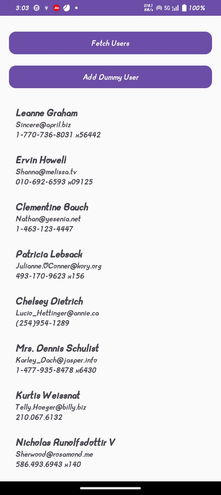

# 👥 UserManagement App

A User Management Android App developed to learn CRUD operations (GET, POST, PUT, DELETE) with REST APIs using Retrofit, Kotlin, and MVVM architecture.

This project demonstrates how to fetch, add, update, and delete users from a backend API and display them in a clean UI using RecyclerView.

# 📌 Features

Fetch users from API (GET request).

Add dummy user (POST request).

Update user details (PUT request).

Delete user (DELETE request).

Uses MVVM architecture with Repository pattern.

Shows live data updates using LiveData or StateFlow.

Lightweight and simple UI to learn API integration.

# 🛠️ Tech Stack

Language: Kotlin

Architecture: MVVM (Model–View–ViewModel)

Networking: Retrofit + Gson Converter + OkHttp

Async: Kotlin Coroutines & LiveData / Flow

UI: RecyclerView, Material Components, CardView

Others: ViewBinding

# 🌐 API Used

A dummy REST API such as https://jsonplaceholder.typicode.com/users
 or your custom backend.

# Operations:

Method	Endpoint	Description

- GET	/users	Fetch all users

- POST	/users	Add new user

- PUT	/users/{id}	Update user

- DELETE	/users/{id}	Delete user

# Screenshots 

### SCREEN

# 📂 Project Structure

app/

 └─ src/main/java/com/example/usermanagement/
 
    ├─ data/
    │   ├─ api/ApiService.kt
    │   └─ api/RetrofitInstance.kt
    │   └─ model/User.kt
    │   └─ model/UserResponse.kt
    ├─ repository/UserRepository.kt
    ├─ ui/
    │   ├─ UserViewModel.kt
    │   ├─ UserViewModelFactory.kt
    │   ├─ UserAdapter.kt
    │   └─ MainActivity.kt

# 📐 Class Diagram

classDiagram

    class ApiService {
        +getUsers()
        +addUser(user: User)
        +updateUser(id: Int, user: User)
        +deleteUser(id: Int)
    }

    class RetrofitInstance {
        +api: ApiService
    }

    class UserRepository {
        +fetchUsers()
        +addUser(user: User)
        +updateUser(id: Int, user: User)
        +deleteUser(id: Int)
    }

    class UserViewModel {
        -repository
        +users: LiveData
        +fetchUsers()
        +addUser(user: User)
        +updateUser(id: Int, user: User)
        +deleteUser(id: Int)
    }

    class UserViewModelFactory {
        +create()
    }

    class MainActivity {
        -adapter
        +observeViewModel()
        +displayUsers()
        +handleUserActions()
    }

    class UserAdapter {
        -items: List<User>
        +bind(user: User)
    }

    class User {
        -id: Int
        -name: String
        -email: String
        -phone: String
    }

    class UserResponse {
        -status: String
        -message: String
        -data: User
    }

    ApiService --> RetrofitInstance
    RetrofitInstance --> UserRepository
    UserRepository --> UserViewModel
    UserViewModel --> MainActivity
    MainActivity --> UserAdapter
    UserAdapter --> User

# 🚀 Future Enhancements

Add search user functionality.

Implement pagination for large user lists.

Add user profile screen with detailed info.

Integrate Room database for offline caching.

Add material design animations for smooth UX.
